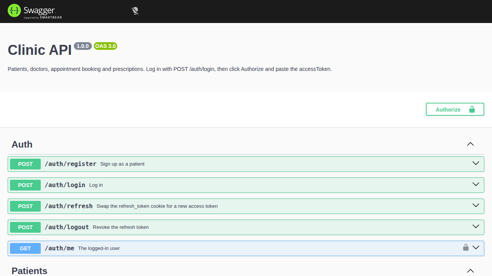
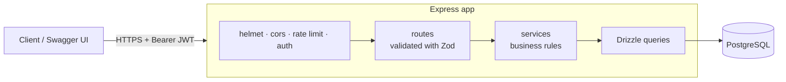

# Clinic API

[](https://github.com/Andreyhuey/node-sample/actions/workflows/ci.yml)

A production-style REST API for a small clinic: patients sign up and book appointments,
doctors run their schedule and write prescriptions, and admins manage the clinic.

**TypeScript · Express 5 · PostgreSQL · Drizzle ORM · Zod · JWT auth · Vitest · OpenAPI · Docker · GitHub Actions**

- **Live demo:** _add your Render or Fly URL here after deploying_ (docs at `/docs`)
- **Try it:** log in as `demo-patient@clinic.dev`, `demo-doctor@clinic.dev` or
  `demo-admin@clinic.dev` with password `demo-password`, then click **Authorize** in the docs.



## What it does

- Patients register, see their own record, book appointments with a doctor, cancel them,
  and read their prescriptions.
- Doctors see their own appointments, mark them completed or no-show, and prescribe.
- Admins manage patients and doctors and give doctors logins.
- Every list is paginated and filterable (search, specialty, status, date range).

## Architecture



Each resource lives in `src/modules/<name>/` split into **routes** (HTTP only),
**schemas** (Zod) and a **service** (rules and queries). Routes never touch SQL; services
never touch `req`/`res`.

```
src/
  app.ts               builds the Express app (tests import this)
  index.ts             starts the server, graceful shutdown
  config.ts            env vars validated with Zod at startup
  release.ts           runs migrations (and demo seed) before each deploy
  openapi.ts           OpenAPI spec built from the same Zod schemas
  db/                  schema, migrations runner, seed scripts
  middleware/          auth, validation wrapper, error handler
  modules/             auth, patients, doctors, appointments, prescriptions
drizzle/               SQL migrations, committed and reviewed like code
test/                  integration tests against real Postgres
```

## Decisions and trade-offs

- **Double booking is prevented by the database, not just the code.** A service-level check
  gives a friendly error, but two requests at the same moment could both pass it. A Postgres
  `EXCLUDE USING gist` constraint on `(doctor_id, tstzrange(starts_at, ends_at))` makes it
  impossible; a test fires six simultaneous bookings and asserts exactly one succeeds.
- **Refresh tokens rotate and detect reuse.** Access tokens are short-lived JWTs (15 min).
  Refresh tokens are random, stored only as SHA-256 hashes, sent as an `httpOnly`,
  `SameSite=Strict` cookie, and work once. Presenting a used token ends every session for
  that user, because it means the token was probably stolen.
- **Keyset pagination instead of OFFSET.** `WHERE (sort_col, id) > (…)` with a matching
  composite index stays fast on deep pages and never skips or repeats rows when data
  changes between requests.
- **One source of truth for validation and docs.** Routes validate with Zod through a typed
  `validated()` wrapper; the OpenAPI spec reuses those schemas, and contract tests check real
  responses against the documented response schemas.
- **Integration tests over mocks.** Tests hit a real Postgres, because the most important
  rules (constraints, transactions, row-level scoping) live in SQL.
- **Migrations run as a release step**, not on app start (on Fly), so a failed migration
  never leaves a half-upgraded app serving traffic.
- **Security basics:** Argon2id password hashing, constant-time-style login for unknown
  emails, per-IP rate limiting on credentials, helmet headers, CORS allow-list, JWT
  algorithm pinning, non-root container.

## Run it locally

```bash
cp .env.example .env
docker compose up -d db     # Postgres on localhost:5432 (also creates clinic_test)
npm install
npm run db:migrate
npm run db:seed-demo        # optional: demo accounts and data
npm run dev                 # http://localhost:3001, docs at /docs
```

Or run the whole stack in containers: `docker compose up --build`.

## Tests

```bash
npm test          # 46 integration tests, about 6 seconds
npm run lint && npm run typecheck && npm run format:check
```

CI runs all of this on every pull request, plus a Docker image build.

## API overview

Full, interactive reference: `/docs`. Raw spec: `/openapi.json`.

| Method             | Path                                               | Who                                          |
| ------------------ | -------------------------------------------------- | -------------------------------------------- |
| POST               | `/auth/register`, `/auth/login`                    | Anyone                                       |
| POST               | `/auth/refresh`, `/auth/logout`                    | Anyone with the refresh cookie               |
| GET                | `/auth/me`                                         | Logged in                                    |
| GET                | `/patients`                                        | Admin, doctor                                |
| POST               | `/patients`                                        | Admin                                        |
| GET, PATCH, DELETE | `/patients/:id`                                    | Admin, doctor (read), the patient            |
| GET                | `/patients/:id/prescriptions`                      | Admin, doctor, the patient                   |
| GET                | `/doctors`, `/doctors/:id`                         | Anyone                                       |
| POST, PATCH        | `/doctors`, `/doctors/:id`, `/doctors/:id/account` | Admin                                        |
| GET, POST          | `/appointments`                                    | Scoped to the caller's own records           |
| GET                | `/appointments/:id`                                | Admin or a participant                       |
| PATCH              | `/appointments/:id/status`                         | Admin, the doctor, the patient (cancel only) |
| GET, POST          | `/appointments/:id/prescriptions`                  | Participants read; the doctor writes         |

Lists return `{ data, nextCursor }`; pass `?limit=` (1 to 100) and `?cursor=`.
Errors always look like `{ "error": { "code", "message", "details"? } }`.

## Deploy

`render.yaml` (Render free tier) and `fly.toml` (Fly.io) are ready to use with a Neon
Postgres database. See [docs/deploy.md](docs/deploy.md).

## Changing the database

Edit `src/db/schema.ts`, run `npm run db:generate`, review the generated SQL in
`drizzle/`, then `npm run db:migrate`. Commit the migration with the code change.
